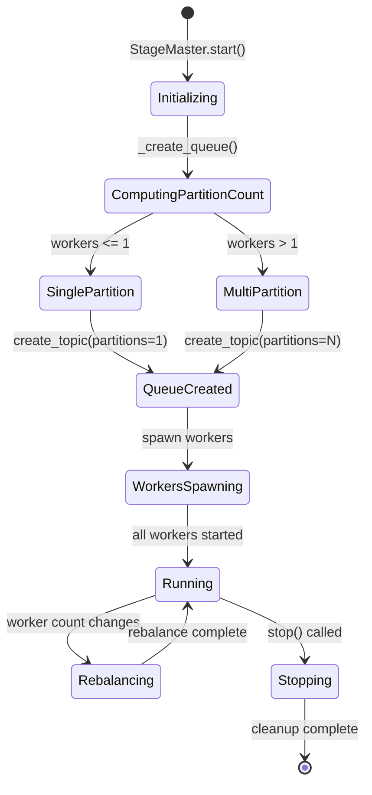
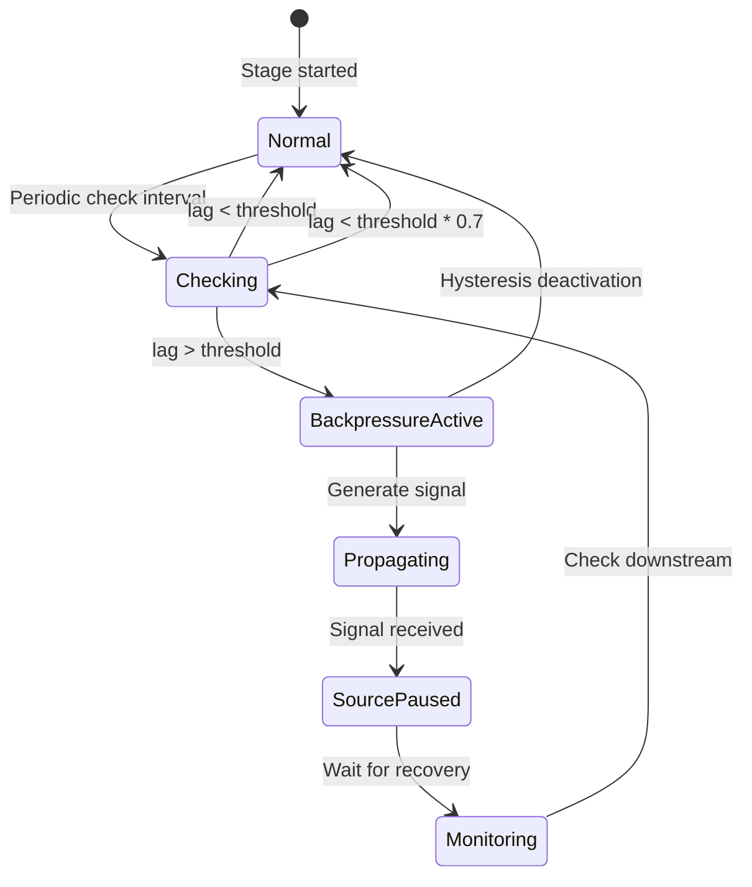
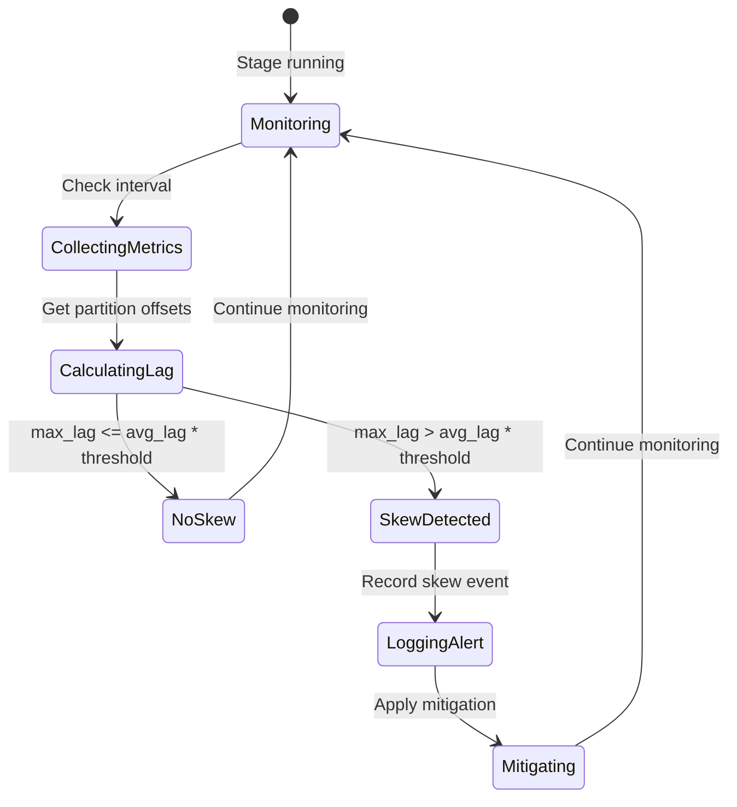

# Partition Management, Skew Detection, and Backpressure Improvements

_Design Document - December 2025_

## Executive Summary

This document describes improvements to the Solstice framework to address three critical issues:

1. **Dynamic Partition Management**: Support for multiple partitions in Tansu queues to enable true parallel consumption when worker count changes dynamically
2. **Partition-Level Skew Detection**: Monitor and detect data skew at the partition level (not worker level) to identify bottlenecks
3. **Universal Backpressure Mechanism**: Implement backpressure that works for all sources (SparkV2, Spark, Lance, File, Iceberg) and operators, not just SparkV2

## Problem Analysis

### Issue 1: Inflexible Tansu Partition Count

**Current State**:
- Tansu queues are created with a fixed 1 partition (`create_topic(topic, partitions=1)`)
- When worker count is dynamically adjusted, multiple workers cannot truly consume in parallel from the same partition due to Kafka/Tansu consumption model limitations
- Issue #7 in `queue-issues-to-resolve.md` explicitly identifies this problem

**Impact**:
- In multi-worker scenarios, effectively only one worker is consuming while others are idle
- Cannot fully utilize dynamically scaled worker resources
- Becomes a performance bottleneck

### Issue 2: Partition-Level Data Skew

**Current State**:
- No monitoring of partition-level consumption progress
- Cannot detect processing speed differences between partitions
- Some partitions may have large data volumes or slow processing, causing overall processing time to be limited by the slowest partition

**Impact**:
- Cannot timely detect and handle data skew
- Some partitions become bottlenecks while others finish but cannot proceed
- Low resource utilization

### Issue 3: Missing Universal Backpressure Mechanism

**Current State**:
- `SparkSourceV2Master` directly calls JVM write in `_execute_spark_write` without checking downstream backpressure state
- Current backpressure mechanism is mainly based on local queue size in `StageMaster`
- No backpressure signal propagation from downstream stages to upstream sources and operators
- All sources (SparkV2, Lance, File, etc.) and operators need backpressure support

**Impact**:
- Sources continue producing data even when downstream cannot process it
- May cause memory overflow or excessive Ray Object Store pressure
- Cannot achieve true flow control

## Architecture Overview

### System Components

The improved system consists of three main components working together:

1. **Partition Manager**: Dynamically creates and manages partitions based on worker count
2. **Skew Detector**: Monitors partition-level progress and detects imbalances
3. **Backpressure Controller**: Manages flow control across the pipeline

### Data Flow with Multiple Partitions

```
┌─────────────────────────────────────────────────────────────────┐
│                    Source Stage                                  │
│  ┌───────────────────────────────────────────────────────────┐  │
│  │  Output Queue (4 partitions)                               │  │
│  │  Partition 0 │ Partition 1 │ Partition 2 │ Partition 3    │  │
│  └──────────────┼─────────────┼──────────────┼──────────────┘  │
└─────────────────┼─────────────┼──────────────┼─────────────────┘
                   │             │             │
         ┌─────────┘             │             └─────────┐
         │                       │                       │
    ┌────▼────┐            ┌──────▼──────┐          ┌────▼────┐
    │ Worker 1│            │  Worker 2   │          │ Worker 3 │
    │ (P0)    │            │  (P1, P2)   │          │  (P3)    │
    └─────────┘            └─────────────┘          └──────────┘
         │                       │                       │
         └───────────────────────┼───────────────────────┘
                                 │
                    ┌────────────▼────────────┐
                    │   Downstream Stage      │
                    │   (Consumes from all)   │
                    └─────────────────────────┘
```

## Solutions

### Solution 1: Dynamic Partition Management

**Implementation Points**:

1. **Dynamic partition count**: Adjust partition count based on worker count
   - In `StageMaster._create_queue`, create partitions based on `max_workers` or current worker count
   - Partition count = min(max_workers, actual needed partition count)
   - Support partition rebalance when workers are dynamically adjusted

2. **Partition assignment strategy**:
   - Use Kafka Consumer Group protocol for partition assignment
   - Each worker is assigned to different partitions for true parallel consumption
   - Trigger rebalance to reassign partitions when worker count changes

3. **Backward compatibility**:
   - For single worker scenarios, maintain 1 partition
   - For multi-worker scenarios, automatically use multiple partitions

**Files Modified**:
- `solstice/solstice/core/stage_master.py` - Modified `_create_queue` method to dynamically set partition count
- `solstice/solstice/queue/tansu.py` - Support partition assignment and rebalance
- `solstice/solstice/core/worker.py` - Workers use consumer group for partition assignment

### Solution 2: Partition-Level Skew Detection and Mitigation

**Implementation Points**:

1. **Partition progress monitoring**:
   - Monitor consumption progress for each partition (latest_offset vs committed_offset)
   - Calculate lag (pending messages) for each partition
   - Periodically collect partition-level metrics

2. **Skew detection algorithm**:
   - Calculate standard deviation or coefficient of variation of all partition lags
   - If lag difference exceeds threshold (e.g., max_lag > avg_lag * 2), skew is detected
   - Record skewed partition IDs and lag values

3. **Skew mitigation strategies**:
   - **Short-term mitigation**: Prioritize scheduling workers processing partitions with high lag
   - **Long-term mitigation**: Consider partition size distribution during next repartition
   - **Alerting**: Log skew events for operations monitoring

4. **Metrics exposure**:
   - Add partition-level lag information to `StageMetrics`
   - Provide skew detection results to autoscaler and monitoring systems

**Files Modified**:
- `solstice/solstice/core/stage_master.py` - Add partition progress monitoring and skew detection
- `solstice/solstice/core/models.py` - Add partition metrics to `StageMetrics`
- `solstice/solstice/queue/tansu.py` - Support querying offsets by partition

### Solution 3: Universal Backpressure Mechanism

**Implementation Points**:

1. **Backpressure signal generation**:
   - In `StageMaster`, generate backpressure signals based on queue lag, queue size, worker utilization, etc.
   - Calculate slow-down factor (0.0-1.0), where 0.0 means complete pause, 1.0 means normal rate
   - Implement `get_backpressure_signal` method (framework exists, needs completion)

2. **Backpressure signal propagation**:
   - Propagate backpressure signals to upstream via `MetaService` or direct calls
   - Upstream stages adjust data production/processing rate based on backpressure signals
   - Support multi-level propagation (stage A -> stage B -> stage C)

3. **Source rate control**:
   - Implement universal rate control mechanism in `SourceMaster` base class
   - Adjust split production rate based on downstream backpressure signals
   - Support pause/resume data production
   - All sources (SparkV2, Lance, File, Iceberg, etc.) inherit this mechanism

4. **Operator rate control**:
   - Support backpressure awareness in `Operator` base class
   - Operators can adjust processing rate based on backpressure signals
   - For stateful operators, support pausing processing

5. **SparkV2 Source special handling**:
   - In `SparkSourceV2Master._execute_spark_write`, periodically check downstream backpressure state
   - If backpressure is detected, pause or slow down Spark data writing
   - Implement streaming write instead of one-time write of all data

**Files Modified**:
- `solstice/solstice/core/stage_master.py` - Complete backpressure signal generation and propagation
- `solstice/solstice/operators/sources/source.py` - Implement universal source rate control
- `solstice/solstice/operators/sources/sparkv2.py` - Integrate backpressure checks
- `solstice/solstice/operators/sources/spark.py` - Integrate backpressure checks (if needed)
- `solstice/solstice/operators/sources/lance.py` - Integrate backpressure checks (if needed)
- `solstice/solstice/operators/sources/file.py` - Integrate backpressure checks (if needed)
- `solstice/solstice/core/operator.py` - Add backpressure awareness interface
- `solstice/solstice/actors/meta_service.py` - Implement backpressure propagation mechanism

## Implementation Plan

### Phase 1: Dynamic Partition Management (Priority: High)

1. Modify `StageMaster._create_queue` to dynamically set partitions based on worker count
2. Implement partition assignment logic (using consumer group)
3. Handle partition rebalance when workers are dynamically adjusted
4. Add unit tests to verify multi-partition creation and assignment

### Phase 2: Partition Skew Detection (Priority: Medium)

1. Implement partition progress monitoring (lag calculation per partition)
2. Implement skew detection algorithm (lag difference detection)
3. Add skew mitigation strategies (prioritize scheduling high-lag partitions)
4. Expose partition-level information in metrics
5. Add tests to verify skew detection and mitigation

### Phase 3: Universal Backpressure Mechanism (Priority: High)

1. Complete `StageMaster` backpressure signal generation
2. Implement backpressure signal propagation mechanism (via MetaService)
3. Implement universal rate control in `SourceMaster` base class
4. Integrate backpressure checks in all sources (SparkV2, Spark, Lance, File, Iceberg)
5. Add backpressure awareness interface to operator base class
6. Add tests to verify backpressure propagation and rate control

## State Transition Diagrams

### Partition Management State Machine

The partition management system transitions through the following states:



### Backpressure State Machine

The backpressure mechanism has the following states:



### Skew Detection State Machine

The skew detection system operates as follows:



## Detailed Implementation

### Solution 1: Dynamic Partition Management

#### State Transitions

**Initialization Phase**:
1. `StageMaster.start()` is called
2. `_create_queue()` is invoked
3. `_compute_partition_count()` calculates partition count:
   - If `partition_count` is explicitly set in config, use that value
   - Otherwise: `max(1, min(max_workers, current_worker_count or max_workers))`
4. Queue backend creates topic with computed partition count
5. Workers are spawned and assigned to partitions via consumer group

**Runtime Phase**:
1. Workers join consumer group with unique consumer IDs
2. Kafka/Tansu automatically assigns partitions to workers
3. Each worker consumes from its assigned partition(s)
4. When worker count changes:
   - New workers join consumer group → triggers rebalance
   - Existing workers may be reassigned to different partitions
   - Rebalance is handled by Kafka/Tansu consumer group protocol

**Shutdown Phase**:
1. Workers leave consumer group gracefully
2. Partitions are reassigned to remaining workers
3. Final offsets are committed

#### Partition Count Calculation Algorithm

```python
def _compute_partition_count(self) -> int:
    """
    Compute partition count based on configuration and worker count.
    
    Priority:
    1. Explicit partition_count in config (if set)
    2. Auto-compute: max(1, min(max_workers, current_workers))
    
    Examples:
        - max_workers=1 → 1 partition
        - max_workers=4, current_workers=2 → 4 partitions (prepare for scaling)
        - max_workers=8, current_workers=3 → 8 partitions
        - partition_count=16 (explicit) → 16 partitions
    """
    if self.config.partition_count is not None:
        return max(1, self.config.partition_count)
    
    if self.config.max_workers <= 1:
        return 1
    
    # Use max_workers to allow room for scaling
    return self.config.max_workers
```

#### Consumer Group Assignment

When workers start consuming:

1. **Worker Registration**:
   - Each worker creates a consumer with `group_id = f"{job_id}_{stage_id}"`
   - Consumer subscribes to the topic (not manual assignment)
   - Kafka/Tansu broker assigns partitions automatically

2. **Partition Assignment**:
   - If N workers and M partitions (M >= N):
     - Each worker gets at least floor(M/N) partitions
     - Some workers may get one extra partition
   - If N workers and M partitions (M < N):
     - Only M workers get partitions
     - Remaining workers wait (will get partitions when M increases or other workers leave)

3. **Rebalance Triggers**:
   - New worker joins
   - Worker leaves (graceful shutdown or crash)
   - Partition count changes (rare, requires topic recreation)

#### Implementation Details

**File: `solstice/solstice/core/stage_master.py`**

```python
async def _create_queue(self) -> QueueBackend:
    """Create queue with dynamic partition count."""
    self._partition_count = self._compute_partition_count()
    
    # Create queue backend
    queue = await self._create_queue_backend()
    
    # Create topic with computed partition count
    await queue.create_topic(self._output_topic, partitions=self._partition_count)
    
    self.logger.info(
        f"Created topic {self._output_topic} with {self._partition_count} partition(s) "
        f"(max_workers={self.config.max_workers})"
    )
    
    return queue
```

**File: `solstice/solstice/queue/tansu.py`**

```python
async def _get_consumer(
    self, topic: str, group_id: Optional[str] = None, partition: Optional[int] = None
) -> AIOKafkaConsumer:
    """Get consumer with automatic partition assignment via consumer group."""
    consumer_key = (topic, group_id, partition)
    
    if consumer_key not in self._consumers:
        consumer = AIOKafkaConsumer(
            bootstrap_servers=f"localhost:{self.port}",
            enable_auto_commit=False,
            group_id=group_id,  # Consumer group for automatic assignment
        )
        await consumer.start()
        
        if group_id:
            # Subscribe - Kafka will assign partitions automatically
            consumer.subscribe([topic])
        else:
            # Manual assignment (backward compatibility)
            partition_id = partition if partition is not None else 0
            consumer.assign([TopicPartition(topic, partition_id)])
    
    return self._consumers[consumer_key]
```

**File: `solstice/solstice/core/worker.py`**

```python
async def _process_from_upstream(self) -> None:
    """Process messages using consumer group for partition assignment."""
    # Use consumer group - partitions assigned automatically
    records = await self.upstream_queue.fetch(
        self.upstream_topic,
        offset=0,  # Offset managed by consumer group
        max_records=self.config.batch_size,
        group_id=self.consumer_group,  # Enable consumer group protocol
    )
    # Process records...
```

### Solution 2: Partition-Level Skew Detection

#### Detection Algorithm

The skew detection algorithm operates in the following phases:

**Phase 1: Metrics Collection**
- For each partition in the topic:
  - Query `latest_offset` (highest offset in partition)
  - Query `committed_offset` for consumer group (last processed offset)
  - Calculate `lag = latest_offset - committed_offset`

**Phase 2: Skew Calculation**
- Calculate statistics:
  - `avg_lag = sum(all_lags) / partition_count`
  - `max_lag = max(all_lags)`
  - `min_lag = min(all_lags)`
  - `skew_ratio = max_lag / avg_lag` (if avg_lag > 0)

**Phase 3: Skew Detection**
- If `skew_ratio > threshold` (default 2.0):
  - Mark `skew_detected = True`
  - Log warning with partition details
  - Record in metrics for monitoring

**Phase 4: Mitigation** (Future)
- Identify partitions with high lag
- Prioritize worker assignment to high-lag partitions
- Consider repartitioning for next job run

#### State Transitions

```mermaid
sequenceDiagram
    participant SM as StageMaster
    participant Q as QueueBackend
    participant SD as SkewDetector
    
    SM->>SD: collect_metrics()
    SD->>Q: get_all_partition_offsets(topic)
    Q-->>SD: {partition_id: latest_offset}
    
    loop For each partition
        SD->>Q: get_committed_offset(group, topic, partition)
        Q-->>SD: committed_offset
        SD: Calculate lag = latest - committed
    end
    
    SD: Calculate avg_lag, max_lag
    SD: Calculate skew_ratio = max_lag / avg_lag
    
    alt skew_ratio > threshold
        SD: skew_detected = True
        SD->>SM: Log warning
    else skew_ratio <= threshold
        SD: skew_detected = False
    end
    
    SD-->>SM: Return metrics with skew info
```

#### Implementation Details

**File: `solstice/solstice/core/stage_master.py`**

```python
async def _detect_partition_skew(
    self, skew_threshold: float = 2.0
) -> tuple[bool, float, Dict[int, int]]:
    """
    Detect partition-level skew.
    
    Algorithm:
    1. Collect lag for each partition
    2. Calculate average lag
    3. Calculate max lag
    4. If max_lag > avg_lag * threshold, skew is detected
    
    Returns:
        (skew_detected: bool, skew_ratio: float, partition_lags: Dict[int, int])
    """
    partition_lags = {}
    
    # Collect lag for each partition
    for partition_id in range(self._partition_count):
        latest = await self._output_queue.get_latest_offset(
            self._output_topic, partition=partition_id
        )
        committed = await self._output_queue.get_committed_offset(
            self._consumer_group, self._output_topic, partition=partition_id
        ) or 0
        lag = max(0, latest - committed)
        partition_lags[partition_id] = lag
    
    if not partition_lags:
        return False, 0.0, {}
    
    # Calculate skew
    lags = list(partition_lags.values())
    avg_lag = sum(lags) / len(lags)
    max_lag = max(lags)
    
    if avg_lag == 0:
        return False, 0.0, partition_lags
    
    skew_ratio = max_lag / avg_lag
    skew_detected = skew_ratio > skew_threshold
    
    if skew_detected:
        self.logger.warning(
            f"Partition skew detected in {self.stage_id}: "
            f"max_lag={max_lag}, avg_lag={avg_lag:.1f}, "
            f"skew_ratio={skew_ratio:.2f}, threshold={skew_threshold}"
        )
    
    return skew_detected, skew_ratio, partition_lags
```

### Solution 3: Universal Backpressure Mechanism

#### Backpressure Flow

The backpressure mechanism follows this flow:

```mermaid
sequenceDiagram
    participant DS as DownstreamStage
    participant BP as BackpressureChecker
    participant US as UpstreamStage
    participant SM as SourceMaster
    
    DS->>BP: collect_metrics()
    BP->>DS: get_input_queue_lag()
    DS-->>BP: lag = 6000
    
    alt lag > threshold (5000)
        BP: backpressure_active = True
        BP->>BP: get_backpressure_signal()
        BP->>US: propagate_backpressure(signal)
        US->>SM: _check_backpressure_before_produce()
        SM-->>US: should_pause = True
        US: Pause split production
    else lag < threshold * 0.7
        BP: backpressure_active = False
        BP->>US: Clear backpressure signal
        US: Resume production
    end
```

#### Backpressure State Transitions

**Normal State**:
- Queue lag < threshold
- All sources producing at normal rate
- No backpressure signals

**Backpressure Active State**:
- Queue lag > threshold OR queue size > threshold
- Backpressure signal generated
- Signal propagated to upstream stages
- Sources slow down or pause production

**Recovery State**:
- Queue lag decreases below threshold * 0.7 (hysteresis)
- Backpressure signal cleared
- Sources resume normal production rate

#### Implementation Details

**Backpressure Detection**:

```python
async def _check_backpressure(self) -> bool:
    """
    Check if backpressure should be activated.
    
    Conditions for activation:
    1. Input queue lag > lag_threshold (default 5000)
    2. Output queue size > queue_size_threshold (default 1000)
    
    Hysteresis for deactivation:
    - Deactivate only when lag < threshold * 0.7
    - Prevents rapid oscillation
    """
    # Check input lag
    input_lag = await self.get_input_queue_lag()
    if input_lag > self._backpressure_threshold_lag:
        if not self._backpressure_active:
            self.logger.warning(
                f"Backpressure activated: lag={input_lag} > threshold={self._backpressure_threshold_lag}"
            )
        self._backpressure_active = True
        return True
    
    # Check output queue size
    if self._output_queue:
        output_size = await self._output_queue.get_latest_offset(self._output_topic)
        if output_size > self._backpressure_threshold_queue_size:
            if not self._backpressure_active:
                self.logger.warning(
                    f"Backpressure activated: queue_size={output_size} > threshold={self._backpressure_threshold_queue_size}"
                )
            self._backpressure_active = True
            return True
    
    # Deactivate with hysteresis
    if self._backpressure_active and input_lag < self._backpressure_threshold_lag * 0.7:
        self.logger.info(f"Backpressure deactivated: lag={input_lag}")
        self._backpressure_active = False
    
    return self._backpressure_active
```

**Source Rate Control**:

```python
async def _check_backpressure_before_produce(self) -> bool:
    """
    Check downstream backpressure before producing splits.
    
    Returns:
        True if production should pause, False if can continue
    """
    if not self._downstream_stage_refs:
        return False  # No downstream, can produce freely
    
    for stage_id, stage_ref in self._downstream_stage_refs.items():
        status = await stage_ref.get_status_async()
        
        # Check backpressure flag
        if status.backpressure_active:
            return True  # Pause production
        
        # Check queue size (early warning)
        if hasattr(status, "output_queue_size"):
            if status.output_queue_size > self._backpressure_threshold_queue_size * 0.8:
                return True  # Pause production
    
    return False  # No backpressure, continue production
```

## Technical Details

### Dynamic Partition Management

```python
# In StageMaster._create_queue
async def _create_queue(self) -> QueueBackend:
    # Determine partition count based on max_workers or current worker count
    partition_count = max(1, min(
        self.config.max_workers, 
        len(self._workers) or self.config.max_workers
    ))
    await queue.create_topic(self._output_topic, partitions=partition_count)
```

### Partition Skew Detection

```python
async def _detect_partition_skew(self, skew_threshold: float = 2.0) -> tuple[bool, float, Dict[int, int]]:
    """Detect partition-level skew.
    
    Returns:
        Tuple of (skew_detected, skew_ratio, partition_lags)
    """
    partition_lags = {}
    for partition_id in range(self._partition_count):
        latest = await self._output_queue.get_latest_offset(
            self._output_topic, partition=partition_id
        )
        committed = await self._output_queue.get_committed_offset(
            self._consumer_group, self._output_topic, partition=partition_id
        ) or 0
        partition_lags[partition_id] = latest - committed
    
    # Detect skew: if max_lag > avg_lag * 2, skew is detected
    if partition_lags:
        avg_lag = sum(partition_lags.values()) / len(partition_lags)
        max_lag = max(partition_lags.values())
        if max_lag > avg_lag * skew_threshold:
            self.logger.warning(
                f"Partition skew detected: max_lag={max_lag}, avg_lag={avg_lag:.1f}"
            )
    
    return max_lag > avg_lag * skew_threshold, max_lag / avg_lag if avg_lag > 0 else 0.0, partition_lags
```

### Backpressure Propagation

```python
# In StageMaster
async def _check_and_propagate_backpressure(self):
    """Check backpressure status and propagate to upstream."""
    if self.backpressure_active:
        signal = self.get_backpressure_signal()
        # Propagate to all upstream stages via MetaService
        await self.meta_service.propagate_backpressure(
            from_stage=self.stage_id,
            slow_down_factor=signal.slow_down_factor
        )
```

### Source Rate Control

```python
# In SourceMaster base class
async def _check_backpressure_before_produce(self) -> bool:
    """Check if we should continue producing data."""
    if not self.downstream_stage_refs:
        return True
    
    # Check all downstream stages for backpressure status
    for stage_id, stage_ref in self.downstream_stage_refs.items():
        status = await stage_ref.get_status_async()
        if status.backpressure_active:
            self.logger.debug(f"Backpressure active from {stage_id}, pausing production")
            return False
    
    return True
```

## Testing Strategy

### Unit Test Coverage Requirements

All three mechanisms require comprehensive unit tests to ensure correctness:

#### 1. Partition Management Tests

**Test Cases**:

1. **Partition Count Calculation**:
   - Test with `partition_count=None` (auto mode)
   - Test with explicit `partition_count` value
   - Test with `max_workers=1` → should return 1 partition
   - Test with `max_workers=4` → should return 4 partitions
   - Test with `max_workers=8, current_workers=2` → should return 8 partitions

2. **Queue Creation**:
   - Test Tansu backend creates topic with correct partition count
   - Test Memory backend warns and uses 1 partition when multiple requested
   - Test partition count is stored in `_partition_count` attribute

3. **Consumer Group Assignment**:
   - Test worker creates consumer with correct group_id
   - Test consumer subscribes (not manual assign) when group_id provided
   - Test manual assignment fallback when group_id is None

4. **Rebalance Handling**:
   - Test new worker joining triggers rebalance
   - Test worker leaving triggers rebalance
   - Test offset commit during rebalance

#### 2. Skew Detection Tests

**Test Cases**:

1. **Partition Lag Calculation**:
   - Test lag calculation for single partition
   - Test lag calculation for multiple partitions
   - Test handling of missing committed offset (defaults to 0)
   - Test handling of partition with no data (lag = 0)

2. **Skew Detection Algorithm**:
   - Test no skew: all partitions have similar lag
   - Test skew detected: one partition has 3x average lag
   - Test edge case: all partitions have lag = 0
   - Test edge case: only one partition has data
   - Test threshold boundary: max_lag = avg_lag * threshold exactly

3. **Skew Ratio Calculation**:
   - Test skew_ratio = 1.0 when no skew
   - Test skew_ratio = 2.5 when max_lag = 2.5 * avg_lag
   - Test skew_ratio = 0.0 when avg_lag = 0

4. **Metrics Collection**:
   - Test `get_partition_metrics()` returns correct structure
   - Test metrics include all partitions
   - Test metrics are included in `StageMetrics`

#### 3. Backpressure Tests

**Test Cases**:

1. **Backpressure Detection**:
   - Test activation when lag > threshold
   - Test activation when queue_size > threshold
   - Test deactivation with hysteresis (lag < threshold * 0.7)
   - Test no activation when lag < threshold
   - Test state persistence across multiple checks

2. **Backpressure Signal Generation**:
   - Test signal is None when backpressure not active
   - Test signal contains correct slow_down_factor
   - Test signal contains correct reason message
   - Test signal timestamp is set

3. **Source Rate Control**:
   - Test `_check_backpressure_before_produce()` returns True when downstream has backpressure
   - Test returns False when no downstream backpressure
   - Test checks all downstream stages
   - Test handles missing downstream stage gracefully
   - Test `_produce_splits()` pauses when backpressure detected
   - Test production resumes when backpressure clears

4. **Backpressure Propagation**:
   - Test signal propagation to upstream stages
   - Test multi-level propagation (A -> B -> C)
   - Test propagation handles missing upstream gracefully

### Integration Tests

#### Test 1: Multi-Partition Parallel Consumption

**Setup**:
- Create stage with `max_workers=4`
- Create topic with 4 partitions
- Produce messages to all partitions
- Start 4 workers

**Verification**:
- Each worker consumes from different partition(s)
- No worker is idle (all partitions consumed)
- Total messages consumed = total messages produced
- No duplicate consumption
- No message loss

**Test Code Structure**:
```python
@pytest.mark.asyncio
async def test_multi_partition_parallel_consumption():
    # Create stage with 4 workers
    config = StageConfig(max_workers=4, min_workers=4)
    master = StageMaster(..., config=config)
    await master.start()
    
    # Verify partition count
    assert master._partition_count == 4
    
    # Produce to all partitions
    queue = master.get_output_queue()
    for partition in range(4):
        for i in range(10):
            await queue.produce(master.get_output_topic(), f"msg_{partition}_{i}".encode())
    
    # Start workers and verify consumption
    # ... (detailed test implementation)
```

#### Test 2: Partition Skew Detection

**Setup**:
- Create stage with 4 partitions
- Simulate skew: partition 0 has 1000 messages, others have 100
- Run skew detection

**Verification**:
- Skew is detected (max_lag=1000, avg_lag=325, ratio > 2.0)
- Correct partition IDs identified
- Metrics include skew information
- Warning logged

#### Test 3: Backpressure End-to-End

**Setup**:
- Create pipeline: Source -> Process -> Sink
- Sink stage processes slowly (simulate blocking)
- Source produces data rapidly

**Verification**:
- Process stage detects backpressure (queue fills up)
- Backpressure signal propagates to Source
- Source pauses or slows production
- When Sink catches up, Source resumes

#### Test 4: SparkV2 Backpressure

**Setup**:
- Create SparkV2 source
- Create downstream stage with backpressure
- Execute Spark write

**Verification**:
- Backpressure checked before write
- Warning logged if backpressure active
- Write completes (current implementation limitation)
- TODO: Future streaming write with pause/resume

### Stress Tests

1. **High Concurrency**:
   - 16 partitions, 16 workers
   - Verify all partitions consumed in parallel
   - Measure throughput improvement vs single partition

2. **Extreme Skew**:
   - 1 partition has 10000 messages, others have 10
   - Verify skew detection works
   - Verify system doesn't crash

3. **Rapid Backpressure Changes**:
   - Rapidly toggle backpressure on/off
   - Verify no race conditions
   - Verify source responds correctly

### Test Implementation Files

Tests should be organized in the following files:

1. `tests/test_partition_management.py` - Partition management tests
2. `tests/test_skew_detection.py` - Skew detection tests
3. `tests/test_backpressure.py` - Backpressure mechanism tests
4. `tests/test_partition_backpressure_integration.py` - Integration tests

Each test file should have:
- Unit tests for individual functions
- Integration tests for component interaction
- Edge case tests
- Performance tests (where applicable)

## Future Work

### Complex Partitioning Strategies

- Key-based partitioning (partition based on data key)
- Custom partition functions
- Dynamic repartition strategies

### Predictive Optimizations

- Partition size prediction based on historical data
- Predictive load balancing
- Predictive backpressure

### Advanced Skew Mitigation

- Automatic repartition (auto-repartition when skew is detected)
- Dynamic partition merge/split
- Intelligent data redistribution

## Risk Assessment

1. **Partition rebalance may cause brief pauses**: Need to implement smooth rebalance to avoid data loss
2. **Backpressure may affect throughput**: Need to balance flow control and performance, set reasonable thresholds
3. **Skew detection may add overhead**: Need to optimize monitoring frequency to avoid excessive checking
4. **Multiple partitions may increase complexity**: Need comprehensive error handling and recovery mechanisms

## Configuration

### Partition Configuration

```python
@dataclass
class StageConfig:
    # Partition configuration
    partition_count: Optional[int] = None  # None = auto based on workers
```

### Skew Detection Configuration

```python
@dataclass
class SkewDetectionConfig:
    enabled: bool = True
    check_interval_s: float = 10.0
    skew_threshold: float = 2.0  # max_lag / avg_lag > threshold indicates skew
```

### Backpressure Configuration

```python
@dataclass
class BackpressureConfig:
    enabled: bool = True
    queue_size_threshold: int = 1000  # Trigger backpressure when queue size exceeds this
    lag_threshold: int = 5000  # Trigger backpressure when lag exceeds this
    slow_down_factor_step: float = 0.1  # Step size for slow-down factor adjustment
```

## References

- [Queue Issues to Resolve](queue-issues-to-resolve.md)
- [Dynamic Worker Scaling](dynamic-worker-scaling.md)
- [Architecture Overview](architecture.md)

---

_Last updated: December 2025_

